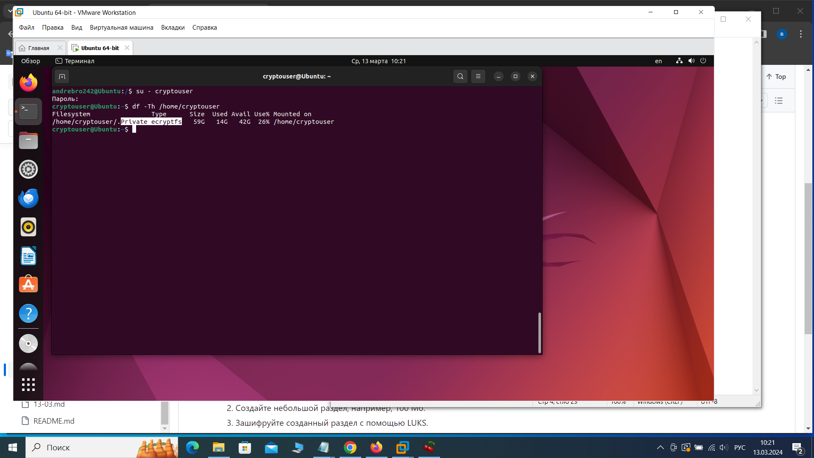

Домашнее задание к занятию «Защита хоста» Брюхов А SYS-26

Задание 1
Установите eCryptfs.
Добавьте пользователя cryptouser.
Зашифруйте домашний каталог пользователя с помощью eCryptfs.
В качестве ответа пришлите снимки экрана домашнего каталога пользователя с исходными и зашифрованными данными.

Решение 1

1.Установка eCryptfs:
    sudo apt install ecryptfs-utils.

2.Добавление пользователя cryptouser с зашифрованным каталогом:
    sudo adduser --encrypt-home cryptouser

3.Добавил пользователя в sudo и зашел под пользователем:
    su - cryptouser

4.Проверил:
    df -Th /home/cryptouser

Результат: Private ecryptfs - каталог зашифрован

Решение 2

1.Установка поддержки LUKS:
    sudo apt install cryptsetup.

2.Создание небольшого раздела:
    sudo fdisk -l
Создаем раздел на sdb
    fdisk /dev/sdb
    n
    p первичный
    Первый сектор (2048-41943039, по умолчанию 2048):
    Last sector, +/-sectors or +/-size{K,M,G,T,P} (2048-41943039, по умолчанию 41943039): +100M
    w
форматируем
    sudo mkfs.ext4 /dev/sdb1
монтируем
    sudo mkdir /mnt/crypto_partition
    sudo mount /dev/mapper/crypto_partition /mnt/crypto_partition

3.шифруем созданный раздел: 
    sudo cryptsetup luksFormat /dev/sdb1

проверяю что раздел зашифрован
    lsblk -f
раздел обозначен как crypto_LUKS 2

